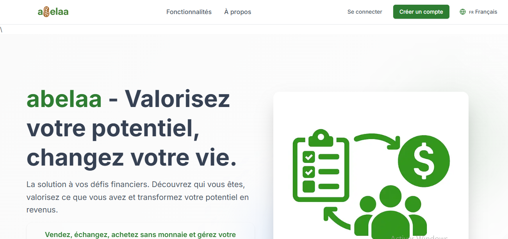

# Inscription

La crétion d'un compte Abelaa est l'opération qui va vous permettre d'exploiter toutes les fonctionnalités de l'application et ainsi gérer au mieux votre fortune caché.

Chez Abelaa il existe deux types de comptes:

- ***Les comptes personnels***
Qui sont destinés aux personnes désireuses de faire leur propres inventaires et de vendre leurs propres objets sans toute fois être qualifié de commerçant.

- ***Les comptes entreprises***
Ces comptes sont destinés aux entreprises, boutiques, ou tout autres entités ayant comme activité principale la vente de biens et/ou la prestation de services.

## **Qui peut s'inscrire sur Abelaa ?**
Abelaa est réservé aux personnes âgées de **18 ans et plus**. Si un enfant de moins de 18 ans souhaite utiliser Abelaa, un parent ou un tuteur doit créer et superviser son compte, assumer l'entière responsabilité de son activité et s'assurer du respect de toutes les exigences légales.

## **Comment créer un compte sur Abelaa?**
La création des comptes abelaa peut se faire de deux manières:

- En utilisant un lien d'affiliation relié au types de comptes souhaiter(voir l'article [obtenir Abelaa](get.fr.md) )

- En utilisant le lien vers le site web d'abelaa [https://test.abelaa.org/](https://test.abelaa.org/)

> si vous utilisez la deuxième option vous devrez cliquer sur **Créer un compte** en haut à droite de la page d'accueil 

### ***Compte personnel***
Pour créer un compte personnel après avoir cliqué sur **Créer un compte** 

1. Choisissez l'option **personnel** 
2. Renseignez tous les champs du formulaire
3. Acceptez les conditions d'utilisations et la politique de confidentialité après lecture et adhération.
4. Cliquer sur **Créer un compte** pour valider

## Vous ne parvenez toujours pas à vous inscrire ?

Suivez ces conseils :

- Assurez-vous que vous n'avez pas déjà un compte Abelaa sous le même e-mail.
- Vérifiez votre adresse e-mail pour les fautes de frappe.
- Assurez-vous d'avoir coché la case Conditions générales et Politique de confidentialité.
- Vérifiez votre connexion internet.
- Créez un mot de passe de 7 caractères ou plus (dont au moins un chiffre). De plus, le mot de passe doit correspondre à la confirmation du bas.
- vérifiez que tous les champs obligatoires soit renseignés.