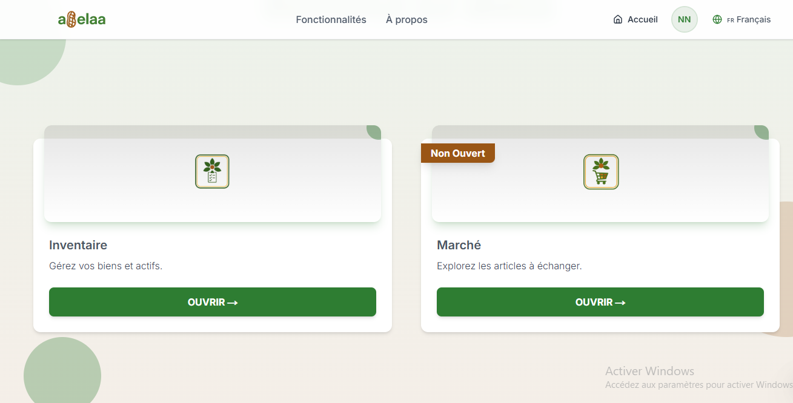
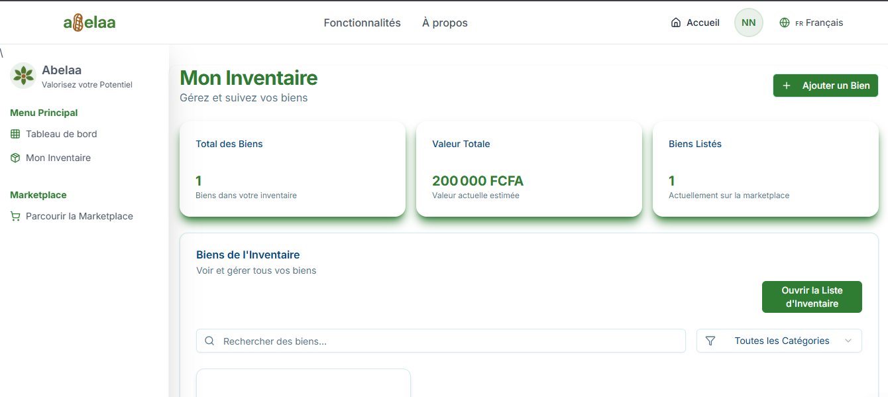

# Inventaire

L'inventaire est l'espace où sont répertoriés tous vos biens. Vous pouvez le remplir et le vider à votre guise pour connaître la valeur de vos biens et gérer efficacement vos possessions.

## Voir tous vos biens

Pour consulter vos biens dans l'inventaire, rendez-vous sur la page d'accueil et appuyez sur « Inventaire ».

Dans cet inventaire, vous pouvez voir tous les biens que vous avez enregistrés. Si la liste est vide, cela signifie tout simplement que vous n'en avez [ajoutez](#comment-ajouter-un-bien-dans-son-inventaire) aucun.

> Si vous avez déjà saisi des articles, mais qu'ils n'apparaissent pas dans votre inventaire, [contactez-nous](https://wa.me/+237698778055)

### *Accéder à la liste d'invetaire*

Pour avoir un affichage sous forme de liste de votre inventaire il suffira de cliquer sur le bouton « Ouvrir la liste d'inventaire » depuis la page d'acceuil de l'inventaire de la vous pourrez: [rechercher un bien](#retrouver-un-bien-dans-linventaire) , [modifier le bien](#modifier-un-article) et [exporter la liste de vos biens](#exporter-la-liste-de-vos-biens)

## Comment ajouter un bien dans son inventaire?

Pour ajouter de nouveau bien dans votre inventaire il vous suffira sur la page de l'inventaire

## Retrouver un bien dans l'inventaire 

### *Les filtres*

## Mettre un bien en vente

## Modifier les informations sur une article

## Supprimer un bien de l'inventaire

Dans l’inventaire,  à supprimer.
Cliquez sur Menu (chevron vers le bas) > Supprimer la discussion > Supprimer.
Autrement, vous pouvez cliquer dans la fenêtre de discussion surPlus d’options (trois points verticaux) > Supprimer la discussion > Supprimer.

> Remarque : la suppression d’un bien est un acte irréversible. Abelaa n’est pas en mesure de récupérer les biens supprimées par vous. Vous ne pouvez récupérer les biens supprimées qu'en les [ajoutant](#comment-ajouter-un-bien-dans-son-inventaire) à nouveau manuellement dans l'inventaire. Veuillez noter que si le bien figurais dans le marketplace il ne sera pas supprimé l'avez déjà vendu ou échangé.

## Exporter la liste de vos biens

