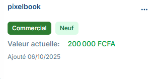

# Inventaire

L'inventaire est l'espace où sont répertoriés tous vos biens. Vous pouvez le remplir et le vider à votre guise pour connaître la valeur de vos biens et gérer efficacement vos possessions.

## Comment voir tous vos biens?

Pour consulter vos biens dans l'inventaire, rendez-vous sur la page d'accueil et appuyez sur « Inventaire ».

Dans cet inventaire, vous pouvez voir tous les biens que vous avez enregistré. Si la liste est vide, cela signifie tout simplement que vous n'en avez [ajouté](#comment-ajouter-un-bien-dans-son-inventaire) aucun.

> Dans le cas ou vous avez déjà saisi des articles, mais qu'ils n'apparaissent pas dans votre inventaire, [contactez-nous](https://wa.me/+237698778055)

### *Accéder à la liste d'invetaire*

Pour avoir un affichage sous forme de liste de votre inventaire il suffira de cliquer sur le bouton « Ouvrir la liste d'inventaire » depuis la page d'acceuil de l'inventaire de là vous pourrez: [rechercher un bien](#retrouver-un-bien-dans-linventaire) , [modifier le bien](#modifier-un-article) et [exporter la liste de vos biens](#exporter-la-liste-de-vos-biens).

## Comment ajouter un bien dans son inventaire?

Vous pouvez enregistrer les biens que vous possédez afin de savoir exactement ce que vous possédez en terme de bien.
Vous pouvez choisir par la suite de le donner a un individu quelconque, un proche et même une entreprise ou de le [vendre](#comment-mettre-un-bien-en-vente).

Pour ajouter un nouveau bien dans votre inventaire il vous suffira sur la page de l'inventaire ou sur le tableau de bord de:

1. cliquer sur « *ajouter un bien* »
2. renseigner  les informations sur le bien
3. ajouter une image principale(obligatoire) et une ou plusieurs image(s) secondaire(s)(facultatif).
4. valider pour enregistrer avec le bouton ***Ajouter un bien***

> Remarque: Si vous avez l'impression que le bouton de validation ne marche pas essayez de remonter dans le formulaire et verifié si tout les champs obligatoires (Marqué par un * rouge) sont renseignés

## Comment retrouver un bien dans l'inventaire ?

Dans l'inventaire, vous pouvez rechercher un bien. Vous pouvez utiliser la barre de recherche dans la liste de l'inventaire ou directement sur la page d'acceuil de l'espace inventaire.

### *Rechercher par mot-clé*

La fonctionnalité de recherche vous permet de rechercher l'un de vos bien à partir d'un mot clé. Pour effectuer une recherche par mot clé dans l'inventaire ou depuis la liste d'inventaire vous devez:

1. Cliquez sur la barre de Rechercher.
2. Entrez le mot que vous recherchez.
3. Le bien sera affiché en bas.

### *ajouter un filtre*

L'ajout d'un filtre permet de chercher un ou plusieurs biens avec des attributes en commun les filtres sont placés à droite de la barre de recherche vous pouvez appliquer un ou plusieurs filtres en sélectionnant sa valeur.

Remarque : Si vous n’arrivez pas à trouver votre bien, assurez-vous que vous l'avez correctement saisi ou que vous ne l'ayez pas déjà supprimé de l'inventaire. Si le nom est bien sais, veuillez contacter le [service client](https://wa.me/+237698778055)

## Comment mettre un bien en vente?

Lorsque vous ajoutez un bien à l'inventaire vous avez la possibilité de le publier dans la marketplace, l’ensemble des utilisateurs de Abelaa peuvent voir l’annonce et acheter ou échanger votre bien.

Le contenu de votre inventaire est confidentiel jusqu'à ce que vous décidez de le mettre en vente, mais les utilisateurs pourront voir tous les articles que vous mettez dans la marketplace.

Depuis votre inventaire puis la page du bien :

1. Cliquez sur **“Mettre en Vente”** ou **“List in Marketplace”**.
    - Une fenêtre (modal) s’ouvre avec un court formulaire.
2. Remplir les Informations Requises. Vous devez renseigner les éléments suivants :
    - ***Quantité*** :Indiquez le nombre d’unités que vous souhaitez mettre en vente ou en échange.
    - ***Numéro WhatsApp du Vendeur*** :Entrez le numéro sur lequel les acheteurs peuvent vous joindre.
    - ***Localisation*** :Indiquez où se trouve le bien.
    - ***Type d’Échange*** : ***vente*** (bien contre argent), ***troc*** (Bien contre bien), ***mixte***(L'un ou l'autre ou les deux)
3. Cliquez sur **“Mettre en Vente”**.

Votre bien est maintenant visible dans la marketPlace par tous les utilisateurs de la plateforme.

## Comment modifier les informations sur une article?

Vous pouvez modifier un article à n'importe quel moment après son [ajout](#comment-ajouter-un-bien-dans-son-inventaire) et il sera instantanément mis à jour dans votre inventaire et sur le MarketPlace si vous l'y avez déjà m'y [en vente](#comment-mettre-un-bien-en-vente). 

## Comment supprimer un bien de l'inventaire?

Dans l’inventaire, survolez le bien à supprimer.
Cliquez sur les trois petits points d'option verticaux choisissez l'option ***supprimer le bien*** puis confirmez la suppression.

> Remarque : la suppression d’un bien est un acte irréversible. Abelaa n’est pas en mesure de récupérer les biens supprimées par vous. Vous ne pouvez récupérer les biens supprimées qu'en les [ajoutant](#comment-ajouter-un-bien-dans-son-inventaire) à nouveau manuellement dans l'inventaire. Veuillez noter que si le bien figurais dans le marketplace il ne sera pas supprimé l'avez déjà vendu ou échangé.

## Comment exporter la liste de vos biens

1. Pour exporter l'historique de votre inventaire à partir de la liste d'inventaire :
2. Ouvrez la liste d'inventaire en cliquant sur ***Ouvrir la liste d'inventaire***.
3. Appuyez sur le bouton Exporter (vous avez le choix entre exporter au format PDF, Excel ou CSV).

> Remarque :

> - Si vous souhaitez exporter dans plusieurs formats, c'est possible. Vous devez simplement appuyer sur les boutons correspondants les uns après les autres.