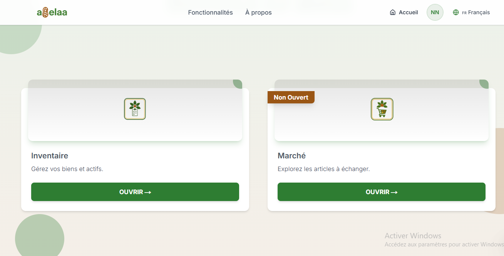
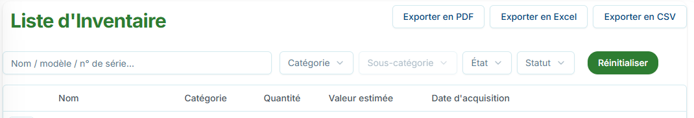

# Inventory

The inventory is the space where all your belongings are listed. You can fill it in and empty it as you wish to know the value of your belongings and efficiently manage your possessions.

## How do I see all my belongings?

To view your assets in the inventory, go to the home page and tap "Inventory".

In this inventory, you can see all the assets you have saved. If the list is empty, it simply means that you haven't added any.

> If you have already entered items, but they do not appear in your inventory, [contact us](https://wa.me/+237698778055)

### *Access the inventory list*

To view a list of your inventory, simply click the "Open inventory list" button from the inventory home page. From there, you can: [search for an item](#find-an-item-in-the-inventory), [edit an item](#edit-an-item), and [export your list of items](#export-your-list-of-items).

## How do I add an item to my inventory?

You can register the items you own so you know exactly what you own.
You can then choose to give it to an individual, a loved one, or even a business, or to sell it (#how-to-list-an-item-for-sale).

To add a new item to your inventory, simply follow the steps on the inventory page or dashboard:

1. Click "Add an item"
2. Enter the item's information
3. Add a primary image (required) and one or more secondary images (optional)
4. Confirm to save with the ***Add an item*** button

> Note: If you feel like the confirmation button isn't working, try going back up the form and checking that all the required fields (marked with a red *) are completed.

## How do I find an item in the inventory?

In the inventory, you can search for an item. You can use the search bar in the inventory list or directly on the inventory home page.

### *Search by keyword*

The search feature allows you to search for one of your assets using a keyword. To perform a keyword search in the inventory or from the inventory list, you must:

1. Click on the Search bar.
2. Enter the word you are looking for.
3. The asset will be displayed at the bottom.

### *Add a filter*

Adding a filter allows you to search for one or more assets with common attributes. Filters are placed to the right of the search bar. You can apply one or more filters by selecting their value.

Note: If you cannot find your asset, make sure you have entered it correctly or that you have not already deleted it from the inventory. If the name is correct, please contact [customer service](https://wa.me/+237698778055)

## How do I list an item for sale?

When you add an item to your inventory, you have the option to publish it on the marketplace. All Abelaa users can view the listing and buy or trade your item.

The contents of your inventory are confidential until you decide to list it for sale, but users will be able to see all the items you list on the marketplace.

To do this, you must [search](#how-to-find-an-item-in-the-inventory) for the item in your inventory and tap the three small vertical dots, then tap ***List for sale*** and confirm the notification that appears at the top of your screen. Your item is now visible on the marketplace.

## How do I edit the information about an item?

You can edit an item at any time after adding it, and it will be instantly updated in your inventory and on the Marketplace if you already have it listed there.

## How do I delete an item from my inventory?

In my inventory, hover over the item I want to delete.
Click on the three small vertical dots, select the ***delete item*** option, and then confirm the deletion.

> Note: Deleting an item is irreversible. Abelaa cannot recover items you have deleted. You can only recover deleted items by manually adding them back to my inventory. Please note that if the item was listed in the marketplace, it will not be deleted if you have already sold or traded it.

## How to export the list of your assets?

1. To export your inventory history from the inventory list:
2. Open the inventory list by clicking ***Open Inventory List***.
3. Press the Export button (you can choose to export to PDF, Excel, or CSV).

> Note:

> - If you want to export to multiple formats, you can. Simply press the corresponding buttons one after the other.