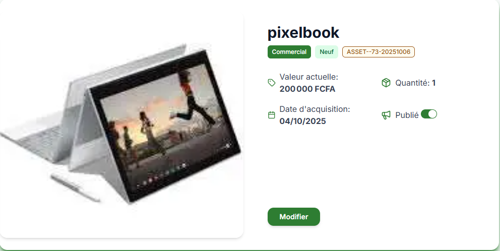

# Market

The Market is a meeting place for sellers and buyers. Here you can display the items in your inventory that you wish to sell or trade. If you wish to add an item to the Market, see the article [add an item to the Market](inventaire.fr/#comment-mettre-un-bien-en-vente)

## **How ​​to View the Market**

You can view the products of a company or individual in the Market or from the dashboard quick actions, accessible via the Market option on the home screen. You can also find your items there if you have published any.

### ***View an Item***

1. Open the Market.
2. Tap *view details*.

## **How ​​to Search for an Item in the Marketplace**

In the Marketplace, you can search for an item or type of item in order to purchase it. You can use the search bar in the MarketPlace area.

### *Search by keyword*

The search feature allows you to search for an item to purchase using a keyword. Perform a keyword search in the MarketPlace.

1. Click on the Search bar.
2. Enter the word you are looking for in the search field.
3. A list of matching products will be displayed at the bottom.

### *Add a filter*

Adding a filter allows you to search for one or more items with common attributes. Filters are placed to the right of the search bar. You can apply one or more filters by selecting their values.

Note: If you are unable to find your item in the MarketPlace, please contact [customer service](https://wa.me/+237698778055).

## *About Buying and Trading*

In the market, you can decide whether to trade or buy. ### ***How ​​to buy an item***

When you buy, you pay a pre-agreed amount to obtain someone else's item.

1. Open the marketplace
2. Locate the item you want to obtain
3. Press **trade** > **buy** > **submit**

### ***How ​​to trade one item for another?***

Unlike buying, bartering requires you to have items in your inventory to exchange them for another.

1. Open the marketplace
2. Locate the item you want to obtain
3. Press **trade** > **Make a trade**
4. Enter the name of the item you wish to trade and select it.
5. Click **submit**

> **Note**

> If the trade is accepted by the other party, you will receive a notification.

## **How ​​to edit one of your items**

To To edit one of your items, you can either [view details](#view-an-item) of your item in the MarketPlace and press the **Edit** button at the bottom. Or you can [edit it in the inventory](inventory.fr/#how-to-edit-item-information).

## **How ​​to remove a product from the marketplace**

If you've changed your mind and decided to no longer sell your item, you can remove it from the marketplace.

1. Open the marketplace
2. Search for your item in the MarketPlace
3. Press **view details**
4. Disable the published option and confirm

## **Related resources**

- [How to add an item to your inventory](inventory.fr.md)
- 